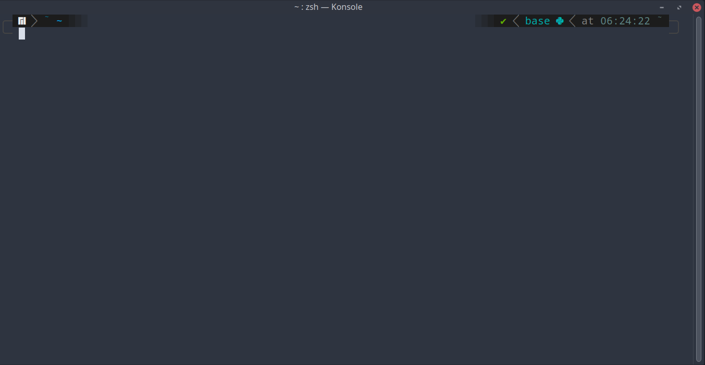
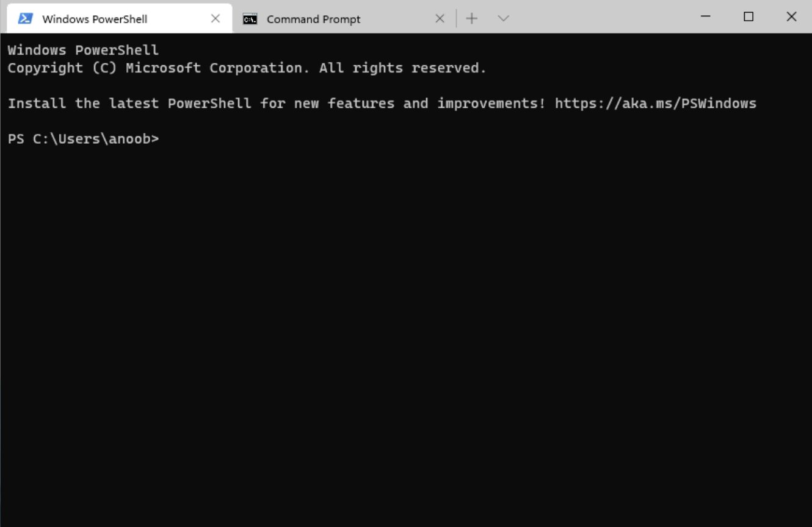

<style type="text/css">
  body{
  font-size: 14pt;
}
</style>


```{r setup, include=FALSE}

options(htmltools.dir.version = FALSE)

library(knitr)
opts_chunk$set(
  prompt = T, ## See hook below. I basically want a "$" prompt for every bash command in this lecture.
  fig.align="center", #fig.width=6, fig.height=4.5, 
  # out.width="748px", #out.length="520.75px",
  dpi=300, #fig.path='Figs/',
  cache=F#, echo=F, warning=F, message=F
  )

## Next hook based on this SO answer: https://stackoverflow.com/a/39025054
knit_hooks$set(
  prompt = function(before, options, envir) {
    options(
      prompt = if (options$engine %in% c('sh','bash')) '$ ' else 'R> ',
      continue = if (options$engine %in% c('sh','bash')) '$ ' else '+ '
      )
})
```

# Introduction

---

Before we start with the shell basics we will quickly run through how to install everything for different operating systems. We will do this in class so that I can see if there are any potential problems. We had some issues last year with the installation process.

Today is about working with a command line interface. There are many shell variants, and we will be working with **Bash** (**B**ourne **a**gain **sh**ell). This is the default for Linux and MacOS and needs to be installed for Windows. It is easiest to work with a Unix based operating system when coding, such as Linux or MacOS. However, I do realise that many of you will be working with Windows.

If you want to know more about Linux then you are welcome to come and speak to me about it. I do most of my work in a Linux environment and I think programming is much easier in Linux and MacOS. I use [Manjaro](https://manjaro.org/), but I think that [PopOS](https://pop.system76.com/) is a good Linux distribution to start with. It is quite similar to MacOS and you don't need to use the command line as frequently as with other Linux distributions.

In this section we will look at how to setup a project as well as how to work with the command line. You might be used to working with graphical user interfaces for most of your coding career, but it is useful to know how to work through the shell. This is not something that is often taught in economics programs, but if you are looking at a career in data science this might be very useful. [Here](https://raw.githack.com/uo-ec607/lectures/master/03-shell/03-shell.html#14) are some of the reasons why we might be interested in using the shell. We will start with looking at the basic file structures within a computer. The key points are the following,

1.  Power 
2.  Reproducibility
3.  Interacting with servers and super computers
4.  Automating workflow and analysis pipelines

The primary references for this section are the notes from [Merely Useful](https://merely-useful.tech/py-rse/) and the slides from [Grant McDermott](https://raw.githack.com/uo-ec607/lectures/master/03-shell/03-shell.html#1)

**Note**: The output displayed will be for the file structure on my computer. For your PC things will obviously be different.

## Motivation

Let us quickly talk about some things that we can use the shell for.

-   renaming and moving files **en masse**
-   finding things on the computer
-   combining and manipulating PDFs
-   installing and updating software
-   scheduling tasks
-   monitoring resources on your system
-   connecting to cloud environments
-   running jobs on super computers

There are many more examples, but these are some of the fundamental things that make the command line useful.

# Hello World!

---

Once you have opened your terminal it should look something like this, 



I am using Linux, so obviously my terminal is going to look different from yours. Mine is customised to look the way I like it. If you are using Windows it will probably look something more along the lines of this, 



The first thing that you want to do is open up the Bash shell. You can do this through the [built-in terminal](https://support.rstudio.com/hc/en-us/articles/115010737148-Using-the-RStudio-Terminal) in **RStudio** if you prefer. I will quickly demonstrate this in class.

To start, when Bash runs it presents us with a \gref{prompt}{prompt}\index{prompt (in Unix shell)} to indicate that it is waiting for us to type something. This prompt is a simple dollar sign by default:

``` bash
$
```

For our very first command in the terminal we will enter `echo 'Hellow World!'` in the command line and see what happens. 

```{bash hello}
echo 'Hello World!'
```

You will see the syntax above for the rest of the notes. The first part is the command that I have entered and below we will see the output from issuing that command. 

## Exercise 

1. Try and print your own name to the terminal.
2. Clear your terminal using the `clear` command.

# Listing files

---

Now that we have that pesky first command out of the way, let us continue our journey with shell commands. The following commands will let us explore our folders and files, and will also introduce us to several conventions that most Unix tools follow. 

The first thing I normally do is check my current working directory and list the files located in this directory. You have encountered the idea of a current working directory in R, so this should be familiar. We can do this by running the following command, which is for **p**rint **w**orking **d**irectory. (Notice that we only run the command, there are no options and arguments).

```{bash}
pwd
```

On my computer the **pwd** is the `01-shell` folder.

It is important to note that all Bash commands have the same basic syntax -- command, option(s), argument(s)

An example would be `ls -l -h ~/dawie/`. We will see what these components mean soon. The options and arguments are not always needed, but you will need a command (such as `ls`). The options start with a dash and are usually one letter. Arguments tell the command what to operate on, so this is usually a file, path or set of files and folders.

In order to see the files **l**i**s**ted in the current working directory we use the `ls` command to list the files. We use the `-a`, `-l` and `-h` options to show `all` the folders and files. The `-l` is for long format and the `-h` is for human readable.

```{bash}
ls -l -a -h 
```

You might notice that there is a lot of information here. Let us analyse this one piece at a time.

The first column indicates the object type. It can either be a (`d`) directory / folder, (`l`) link or (`-`) file. In the case of the first line, we see that this is a directory.

The following nine columns indicate the permissions associated with the objects user types. In this case we have `r` (read), `w` (write) or `x` (execute) access. The `-` indicates missing permissions.

The remaining columns represent the hard links to the object, the identity of the owner's of the object and then descriptive elements about the object.

In terms of the first row, the output shows a special directory called `.`, which is the current working directory. In the second row, we have `..` which means the directory that contains the current one. This is referred to as the **parent** directory.

Beyond the first two columns, the rest of the objects are files. We can see the files listed here are Jupyter notebooks, `html` files and some `RMarkdown` files.

# The manual

---

It is worth noting that options for many of the commands, such as `ls`, is contained in the manual. We can access the manual for the command in the following way, 

```{bash}
man ls | head -n 30 # head lets us look at the first 30 lines here
```

# Navigating directories

---

Now let's navigate to the `research project` folder. In order to this we will use the `cd` command to **c**hange **d**irectory. In this case I know that the `research-project` folder is located higher up in the file structure (in the parent directory). In order to go back one level in the directory, we can use the following command,

```{bash}
cd .. 
pwd
```

If you wanted to move up higher than the parent directory, you could use `cd ../..`, which moves up two directories.

The parent directory in our case is called `DataScience-871`. Once again, list the folders and files to get an idea of directory structure.

```{bash}
cd ..
ls -a # you can use whichever options you prefer
```

We can see the folder we are `research-project` folder we are looking for and can easily access it by using the `cd research-project` command.

```{bash}
cd ..
cd research-project ## Move into the "research-project" sub-directory of this lecture directory.
pwd
```

However, let us go to the **home** directory and navigate to the `research-project` folder from there. This is a good exercise that you can follow on your computer at home. We start with just typing `cd`. This will navigate us to the home directory for the current user.

```{bash}
cd
pwd
```

Let us quickly analyse the directory output above. The first component is the **root** directory and this holds everything. This refers to the slash character `/` on its own. Next we have the **home** directory, which contains the directory for the current user, which in this case is `dawie`. The second slash operator is a separator. In Windows this would have been two backslashes (`\\`) instead of a forward slash. Also, in Windows the **home** directory is usually called `Users`.

Another shortcut to get to the **home** directory is to use the command `cd ~`, where the `~` is a special shortcut for **home**.

From this point I am going to navigate to my `DataScience-871` folder. From above you can see the absolute path of the folder. In my case I first need to change the directory to the `Dropbox` folder.

```{bash}
cd ~/Dropbox
pwd
```

Now that I am in the Dropbox folder I want to go to my `2022` folder. I can do this as follows,

```{bash}
cd ~/Dropbox/2022
pwd
```

Now let's take a quick look at the folders that are located in my 2022 folder.

```{bash}
cd ~/Dropbox/2022
ls -a
```

If we try and move to a folder that doesn't exist in this directory we will receive an error message.

```{bash}
cd ~/Dropbox/2022/comp
pwd
```

The relevant folder seems to be te `871-data-science` folder. So we change the directory once again. We keep doing this till we get to the `DataScience-871` folder. Obviously on your system this will be saved in a different location. You should know where the folder is located on your computer. We can briefly discuss this in class. There are slight differences for different operating systems.

```{bash}
cd ~/Dropbox/2022/871-data-science/DataScience-871
ls
```

We see that one of the folders is called `research-project`. That is where we want to navigate, so we use the `cd` command along with the folder name as follows.

```{bash}
cd ~/Dropbox/2022/871-data-science/DataScience-871/research-project
pwd
```

You can now see that the **pwd** is the `research-project` folder. Let us explore this folder to see what it contains.

```{bash}
cd ../research-project
ls -l -h
```

In this folder structure you can see a broad template for organising a small project.

For this project you see that here is a `README.md` file that gives us the basic information of the project. You might often see `licence`, `conduct` and `citation` files in projects, but we won't be dealing with those in detail in this course. The only boilerplate file that you need to concern yourself with is the `README.md` document, which we will talk about a bit more when we deal with **version control**. You will notice that this has the `.md` extension, which indicates that this is a Markdown file. This entire notebook was written in Markdown and I will talk about the format briefly in the lecture.

The directories for this project are organised by purpose.

Some runnable programs are located in the `bin` folder.

One normally keeps source files in a folder named the `src` folder, which includes your shell scripts and R / Julia scripts.

`src` folders normally contain human readable code and `bin` the computer readable codes. This is not an important distinction for our purposes. We will mostly work with source code.

Our raw data goes into the `data` folder and the data in this folder is never modified. This is the original raw data.

Results are put in the `results` folder. This includes the cleaned data, figures and other components that are created from the `bin`, `src` and `data` folders.

# Creating directories

---

In the next part we will be creating some files and directories that relate to our research project. In order to do this we use the command `mkdir`, which is short for **m**ake **d**irectory.

```{bash}
cd ../research-project
rmdir new_dir # remove in case it already exists
mkdir new_dir
ls
```

You should now be able to see the `new_dir` directory that we have created with this command. This is similar to creating a new folder, as you would with a graphical file explorer in your operating system of choice.

# Naming directories

---

There are a few "rules" about naming directories that we can quickly mention. 

1. Don't use spaces. 
2. Don't begin the name with a dash
3. Stick to letters, digits, dashes and underscores for names. 

Examples of bad names

- Data Science 871 -- Has spaces
- -DataScience871 -- Starts with a dash
- #DataScienceLife -- Don't use hashtags!

Examples of "good" names

- DataScience871
- DataScience-871
- datascience-871
- data_science_871

I generally stick to lowercase with dashes, but that is a preference. It is simply easier to type.

# Using `touch` and `rm`

---

Getting back to our example with the new directory we just created. 

```{bash}
cd ../research-project
ls new_dir
```

You will see that this directory is empty. So let us create a file and put it into this new directory. The files name is going to be `draft.txt`. The `.txt` extension indicates to us that this will be a text file. in order to create an empty file we can use the `touch` command. 

```{bash}
cd ../research-project/new_dir
touch draft.txt
ls
```

We can also delete the objects that we created with the `rm` command.

**NB** Please note that there is no **undo** option with the shell. If you remove something it is permanently deleted. So make very sure about your actions before commiting. This is one of the reasons why version control is so important, which we will discuss in the next lecture. 


```{bash}
cd ../research-project/new_dir
rm draft.txt
ls
```

If you wanted to delete the entire directory then you would have to use `rmdir`. If there are files in the directory you will get a warning telling you that this might not be the best idea. If there are files and you want to remove the directory, then you can use the recursive option `-r`.

```{bash}
cd ../research-project
rmdir new_dir
ls
```

You will note that `new_dir` is now gone from the list. 

# Copying and renaming

---

Another important command is copy. Let us make a new sub-directory with copies and then copy across files from another folder. 

```{bash}
cd ../research-project
#rmdir examples -r # delete in case this already exists (just for this example)
#mkdir examples
cd examples
touch example1.txt example2.txt
```

Let us now copy `example1.txt` into the `docs` folder with a new name. 

```{bash}
cd ../research-project
cp examples/example1.txt docs/doc1.txt
ls docs
```

We can also move and rename files with the `mv` command. This is similar to copying, but completely moves the file to a new location. 

```{bash}
cd ../research-project
mv examples/example2.txt docs
ls docs
```

We can also move the file back to its original location. 

```{bash}
cd ../research-project
mv docs/example2.txt examples
ls docs
```

If you are moving the object into the same directory but with a new object name, then you are effectively just renaming it. 

```{bash}
cd ../research-project
mv docs/doc1.txt docs/doc_new.txt
ls docs
```

There is a more convenient way to do this, the `rename` function. The syntax here is `pattern`, `replacement`, `file(s)`.

```{bash}
cd ../research-project
rename txt csv docs/doc_new.txt
ls docs
```

We can also easily revert our changes. 

```{bash}
cd ../research-project
rename csv txt docs/doc_new.csv
mv docs/doc_new.txt docs/doc1.txt
ls docs
```

# Wildcards `*` and `?`

---

The place where `rename` is super useful is when we can use it in combination with regular expressions and **wildcards**. You would have dealt with the concept of regular expressions in the first part of the course. 

With these methods we could change all the `.txt` file extensions in the exmamples folder to `.csv` in one line. 

```{bash}
cd ../research-project
rename txt csv examples/* # the star represents the wild card expression here
ls examples
```

We can then just as easily change it back, with a similar command. Make sure you understand what is happening here. 

```{bash}
cd ../research-project
rename csv txt examples/* 
ls examples
```

Wildcards are special characters that can be used as a replacement for other characters. The two most important ones are the `*` and `?`. 

# Working with text files

---

Next we will take a look at some data from the Project Gutenberg website. We have some full ebooks in our data folder. 

```{bash}
cd ../research-project
ls data
```

There are some really interesting books in this folder. I recommend reading all of them if you have the time (especially `Frankenstein`!). If you don't have a lot of time read `Time Machine`, it is quite short.  
## The word count command `wc`

Moving on, we can use the `wc` command, which is short for **w**ord **c**ount, which will tell us how many lines, words and letters there are in a file.  

```{bash}
cd ../research-project
wc data/moby_dick.txt
```

We can't actually run the `wc` command on the entire directory. 

```{bash}
cd ../research-project
wc data
pwd
```

If we wanted to know the word counts for all the books in the folder we could use wildcards. 

```{bash}
cd ../research-project
wc data/*.txt
```

We could also just show the number of lines in each file,

```{bash}
cd ../research-project
wc -l data/*.txt
```

The easiest way to read text is with the `cat` command, which stands for "concatenate". `cat` will read in *all* of the text. We don't want all the text, we simply want the first few lines. For this we can use the `head` command. This is similar to the `head` command in R.  
 
```{bash}
cd ../research-project
head -n 18 data/frankenstein.txt
```

## Regular expressions

If we want to find specific patterns in the text, we can use regular expressions type matching with `grep`. This stands for "global regular expression print".

What if we wanted to find some famous line in `Frankenstein`. One such line is,  

> I was benevolent and good; misery made me a fiend.

We can search for the first part of the sentence as follows, 

```{bash}
cd ../research-project
grep -n "I was benevolent" data/frankenstein.txt 
```

We can look for specific words as well, such as *fear*. 

```{bash}
cd ../research-project
grep -n "fear" data/frankenstein.txt | head -n 5
```

It seems there is a lot of fear related words in the book! However, what if we are looking just for `fear` and not words like `fearful` that contain `fear`. In this case we can use the `-w` flag. It indicates we are looking to match the whole word. 

```{bash}
cd ../research-project
grep -n -w "fear" data/frankenstein.txt | head -n 5
```

We can use `grep` to find patterns in a group of files as well. Say we want to find the word *benevolent* across all the books in the directory, 

```{bash}
cd ../research-project
grep -R -l "benevolent" data/
```

It seems that only four books in our list contain the word. It should be noted that there are many options for `grep`. If you want to find out what functions are available you can consult the manual for the command by the `man` command. 

One of the things that we could do is figure out how many lines in the books in our list contain the word *benevolent*. 

```{bash}
cd ../research-project
grep -w -r "benevolent" data | wc -l
```

It looks like there are 23 lines in all of the books that contain this specific word. 

One of the real powers of regular expressions is the fact that we aren't limited to characters and strings when defining our search, we can also use **metacharacters**.

Metacharacters are characters that can be used to represent other characters. As an example, the period `"."` is a metacharacter, which represents *any* character. If we wanted to search `Frankenstein` for the character `"a"` followed by any character and then followed by the character `"x"` we could use the following command, 

```{bash}
cd ../research-project/data
grep -P "a.x" frankenstein.txt
```

You see some nice words here like **a**n**x**ious or **a**n**x**iety. Besides metacharacters that represent other characters, we also have quantifiers which allow you to specify the number of times a particular regex should appear in a string. The most basic quantifiers are `+` and `*`. The plus represents one or more occurrences of the preceding expression. This means an expression like `s+as` would mean, one or more `s` followed by `as`. Let us illustrate with an example, 

```{bash}
cd ../research-project/data
grep -P "s+as" frankenstein.txt
```

Some examples here are di**sas**ter and a**s**s**as**in. 

It is not possible to go through all the cool things you can do with regular expressions in our lecture, so you can go and read more on it [here](https://seankross.com/the-unix-workbench/working-with-unix.html) if you find this interesting. 

## Finding files

While the `grep` command helps us to find things in files, we can use `find` to find files themselves. We can use `find .` to find and list everything in a directory. 

```{bash}
cd ../research-project
find .
```

If we only wanted to find directories then we could do, 

```{bash}
cd ../research-project
find . -type d
```

What about finding the files?

```{bash}
cd ../research-project
find . -type f
```

We could also find files of a certain type using the `*` wildcard. 

```{bash}
cd ../research-project
find . -name "*.txt"
```

We can combine some of the knowledge we have accumulated thus far to see how large the files are in terms of number of lines, 

```{bash}
cd ../research-project
wc -l $(find . -name "*.txt")
```

You will often have `find` and `grep` used together. The following is a nice way to show the author of each of the books in the `data/` directory,

```{bash}
cd ../research-project/data
grep "Author:" $(find . -name "*.txt")
```

## Using `awk` and `sed`

Let us continue on our route of manipulating text in the shell. We encounter two more tools, `sed` and `awk`. 

```{bash}
cd ../research-project
cat examples/nursery.txt
```

Let us now change "Jack" to "Bill". 

```{bash}
cd ../research-project
sed -i 's/Jack/Bill/g' examples/nursery.txt
cat examples/nursery.txt
```

And then change is back. 

```{bash}
cd ../research-project
sed -i 's/Bill/Jack/g' examples/nursery.txt
cat examples/nursery.txt
```

In this next example we are going to count the 10 most commonly used words in `Frakenstein`. We are going to be using a pipe operator `|`, similar to the one that you have used in R, to chain some commands together. We will also use the redirect operator `<`. 

```{bash}
cd ../research-project
sed -e 's/\s/\n/g' < data/frankenstein.txt | sort | uniq -c | sort -n -r | head -10
```

Let us talk a bit more about the pipe and redirect operator.

# Pipes and redirect

---

You can send output from the shell to a file using the redirect operator `>`. We can print a message to the shell using the `echo` command. 

```{bash echo_1}
echo "The shell really isn't all that scary. Or is it?"
```

You could also save this output to a file, just send it to a particular filename. 

```{bash redirect_1}
cd ../research-project/examples
echo "Some text for the example file" > example3.txt
ls -a
```

You can see that `example3.txt` has now been created and if you open the file you will see the text located in that file. You can append the text in an existing file if you use `>>`.

```{bash redirect_2}
cd ../research-project/examples
echo "Some more text for the example file! We appended!" >> example3.txt
cat example3.txt
```

A nice operation that you can do with the shell, when working with `git`, is to issue the following command, `echo "*.csv" >> .gitignore`. Can you figure out what this is going to do and why it is useful?

Next we discuss the pipe operator in a bit more detail. You should be familiar with how this works in R by now, but is also a really cool feature that can be used in the shell. 

We can easily chain together a string of simple operations and make it something quite complex. See the following example, 

```{bash pipe_1}
cd ../research-project
cat -n data/frankenstein.txt | head -n1002 | tail -n10
```

If we wanted to check which of the books is the longest in this list we could do the following. First, we use the redirect operator `>` to send the list of line lengths to a text document, instead of printing it to the shell. Second, we use the `sort` command to sort the lines in the file. We use the `-n` flag to sort numerically.

```{bash}
cd ../research-project
wc -l data/*.txt > examples/lengths.txt
sort -n examples/lengths.txt
```

It seems that Moby Dick is the longest book and Time Machine the shortest. See, I told you it was a quick read. Frankenstein is second shortest, also a really good book, so it is worthwhile reading. 

```{bash}
cd ../research-project
rm examples/lengths.txt
```

We remove the lengths file since we aren't going to be using it further.

A much easier way to have done the same operation above uses a pipe operator.  

```{bash}
cd ../research-project/data
wc -l *.txt | sort -n
```

Next lets move on to an interesting topic that you would have encountered in R. The usage of `for loops`.

# Iteration (for loops)

---

These loops work similar to those in other programming languages. The basic syntax is the following, 

```bash
for i in LIST
do 
  OPERATION $i ## the $ sign indicates a variable in bash
done
```

We can also condense things into a single line by using ";" appropriately. 

```bash
for i in LIST; do OPERATION $i; done
```

The second method is more compact and perhaps better to use in the shell. The semicolons indicate line endings. Let us show an example of a for loop in the shell. 

```{bash for1a}
for i in 1 2 3 4 5; do echo $i; done
```

We could have also used the brace expansion `{1..n}` instead of writing out all the numbers from `1` to `n`.

```{bash for1b}
for i in {1..5}; do echo $i; done
```

A loop might be useful if we wanted to repeat a certain set of command for each item in a list. Let us go back to our Project Gutenberg example. Suppose we wanted to take the first 8 lines out of each book whose name starts with an `s` (after the initial 9 lines of preamble). We then want code to take 8 lines after the first 9 lines. We actually did something similar to this before, 

```{bash repeat_1}
cd ../research-project
head -n 17 data/frankenstein.txt | tail -n 8
```

We can use wildcards to find all the books that start with `s`,  

```{bash repeat_2}
cd ../research-project
for filename in data/s*.txt; do head -n 17 $filename | tail -n 8; done
```


# Shell scripting

---

We can explore data and file structure with the shell, but we can also write shell scripts that combine commands. These scripts normally have a `.sh` extension. 

I have written a short shell script called `hello.sh`. You can probably guess what the script is going to say / do?

```{bash shell_script_1}
cd ../research-project
cat examples/hello.sh
```

From reading this you might be able to figure out what is does, but let us unpack it. 

- `#!/bin/sh` is a *shebang*. This indicates which program should be used to run the command. 
- `echo -e "\nHello World!\n"` is the actual command that we would like to run. The `-e` flag tells `bash` to evaluate an expression. 

If we want to run this script then we can simply type the filename. 

```{bash shell_script_2}
cd ../research-project
bash examples/hello.sh
```

The directory for runnable programs is normally the `bin/` directory. We have one of these in our file structure. Within that directory we also have a file called `book_summary.sh`, which is an empty shell script that we can fill from the shell. 

We start by writing to the empty shell script with the following command,  

```{bash shell_script_3}
cd ../research-project/bin
echo "head -n 17 ../data/moby_dick.txt | tail -n 8 | grep Author" > book_summary.sh
```

Can you make sense of what is happening here? If you are following along with these commands then you are starting to understand shell commands. 

We can run the shell script as before, 

```{bash shell_script_4}
cd ../research-project/bin
bash book_summary.sh
```

# Editing text files

---

I will say a few words in class about editing text files and text editors that you could potentially use. This is an important topic, but we do not have the scope to fully cover it in this lecture. I mostly use [VS Code](https://code.visualstudio.com/) to edit text documents. However, there are other options like [nano](https://www.nano-editor.org/), [vim](https://www.vim.org/) and [Emacs](https://www.gnu.org/software/emacs/) for those that are interested. You can also use `RStudio`, but I wouldn't really recommend it. There are better text editors with much more functionality. 

As always, find what works best for you. Find the space that best fits your style and you will enjoy the journey so much more.   

# Make

---

In the early days of computing there were not nice user interfaces that we saw today. Most of the work was done on the command line. This is exactly why the tools on the command line are so well developed. One of the primary things computer scientists wanted to do was to share software, but it was always a bit tricky to install software across different systems. This is where `make` comes in. The idea behind `make` is the following, 

1. Download files required for installation into a certain directory.
2. `cd` into that directory.
3. Run the `make` command.

In order to do this one had to construct a `makefile` that contains all the instructions on how different parts of the downloaded components need to interact with each other. The nice thing about `make` is that it allows for a process whereby we can create documents **automatically**. This is amazing for reproducibility in projects! You are essentially writing down the steps whereby things should be executed in order to get to a finished product. 

We will show a very easy example of constructing our own `makefile` and in the next lecture we will go into version control and project management in a bit more detail.  

We created a `makefile` file in the `journal` directory of the `research-project` folder, using a text editor (in this case VS Code). In the makefile we have the following text, 

```bash
draft_journal_entry.txt:
  touch draft_journal_entry.txt
```

The general format for `makefile` entries are the following, 

```bash
[target]: [dependencies...]
  [commands...]
```

The indent in the second line is important. It should be done with the `tab` key. If this whitespace is not used then the command will not execute. 

In our simple example above, the **target** is the text file `draft_journal_entry.txt`. This file is created with the `touch` **command** in the second line. We can check the `journal` folder to see the contents. 

```{bash}
cd ../research-project/journal
ls
```

Let us know use the `make` command to see if the `makefile` is properly executed. 

```{bash}
cd ../research-project/journal
make draft_journal_entry.txt
```

It seems like this has worked properly. We have created a new file with our command in the `makefile`. Let us try running it again and see what happens. 

```{bash}
cd ../research-project/journal
make draft_journal_entry.txt
```

Interesting, it tells us that the commands are up to date. This means that there is nothing to be done. 

Now let us do something more complex. Let us add a table of contents to our journal, 

```{bash}
cd ../research-project/journal
echo "1. 2022-02-11-Lecture-Stellenbosch" > toc.txt
ls
```

Next, let us edit our `makefile` in VS Code to include the following lines, 

```bash
readme.txt: toc.txt
  echo "This journal contains the following number of entries:" > readme.txt
  wc -l toc.txt | grep -P -o "[0-9]+" >> readme.txt
```

Now let us run `make` with the `readme.txt` as the target. 

```{bash}
cd ../research-project/journal
make readme.txt
```

To see that this works, let us look at the contents of `readme.txt`.

```{bash}
cd ../research-project/journal
cat readme.txt
```

Now let’s modify `toc.txt` then we’ll try running `make` again.

```{bash}
cd ../research-project/journal
echo "2. 2022-02-12-Chilling-SomersetWest" >> toc.txt
make readme.txt
cat readme.txt
```

In order to simplify the `make` experience, we can create a rule at the top of our `makefile` called `all` where we can list all of the files that are built by the `makefile`. By adding the `all` target we can simply run `make` without any arguments in order to build all of the targets in the `makefile`.

Let us edit our `makefile` in VS Code so that it looks as follows, 

```bash
all: draft_journal_entry.txt readme.txt

draft_journal_entry.txt:
  touch draft_journal_entry.txt
  
readme.txt: toc.txt
  echo "This journal contains the following number of entries:" > readme.txt
  wc -l toc.txt | egrep -o "[0-9]+" >> readme.txt

clean:
  rm draft_journal_entry.txt
  rm readme.txt
```

We add the `clean` rule to destroy the files created in our `makefile`. Normally you wouldn't do this, but for the purpose of the lecture it helps to keep the folder empty if we want to repeat the process from the start.   

Let’s save and close our `makefile` then let’s test it out. First let’s clean up our repository:

```{bash}
cd ../research-project/journal
make clean
ls
```

The `clean` command works like expected. Now let us simply run the `makefile` and check that it executes the correct commands. 

```{bash}
cd ../research-project/journal
make
ls
```

It does exactly what we wanted it to do. Success! 

In the next lecture we will be looking at some examples that include `R` scripts, so that we can show how powerful `make` really can be. However, even if you didn't understand it all fully, you might already feel like this is something that could be useful in automating a lot of processes.  

# Conclusion

---

This has been a lot of information to process. Hopefully you found it useful. We will be seeing more on shell commands in some of our other lectures, so this work will not go to waste. 

There are many topics that we did not cover, in particular SSH, but we will perhaps have time to look at some more ideas as we continue the course. Especially toward the end of the course when we talk about cloud computing. 

There is so much you can do with the command line, that there is even a book called "Data Science at the Command Line". It is worth checking out if you are interested. 


