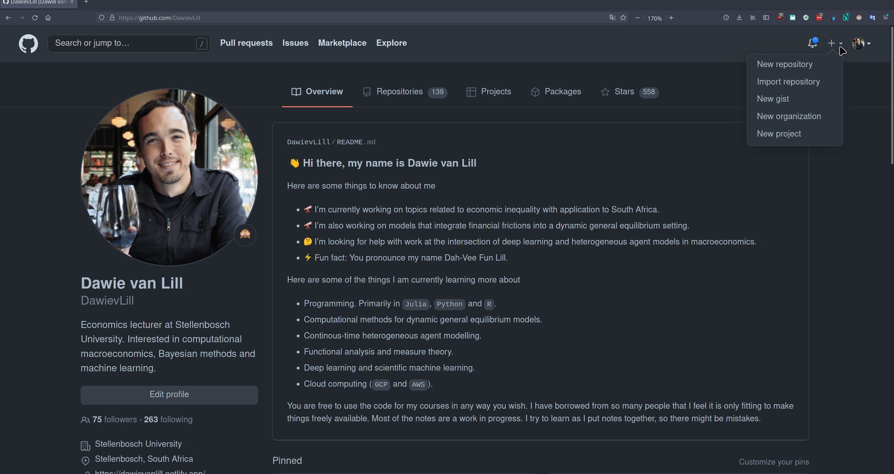
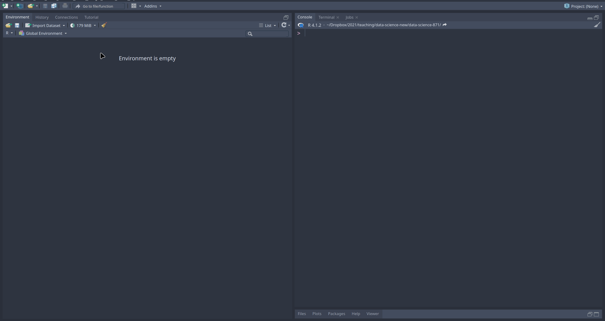

<style type="text/css">
  body{
  font-size: 13pt;
}
</style>

```{r setup, include=FALSE}

options(htmltools.dir.version = FALSE)

library(knitr)
opts_chunk$set(
  prompt = T, ## See hook below. I basically want a "$" prompt for every bash command in this lecture.
  fig.align="center", #fig.width=6, fig.height=4.5, 
  # out.width="748px", #out.length="520.75px",
  dpi=300, #fig.path='Figs/',
  cache=F#, echo=F, warning=F, message=F
  )

## Next hook based on this SO answer: https://stackoverflow.com/a/39025054
knit_hooks$set(
  prompt = function(before, options, envir) {
    options(
      prompt = if (options$engine %in% c('sh','bash')) '$ ' else 'R> ',
      continue = if (options$engine %in% c('sh','bash')) '$ ' else '+ '
      )
})
```

# Introduction

---

Let us start by saying that the session for today is going to contain much less information, but is perhaps more difficult to internalise. It will take you some time to get used to `Git`. Don't worry, this is new for most people. 

We will start by going through version control and at the end we will talk a bit more about `make`. In particular we are going to talk about how you can automate an `R` project with `make`. 

The lecture will be quite hands on and will help you get started with `Git`. Please note that this is a **very basic introduction** and does not constitute a deep dive into `Git`.

First, we need to do a quick check to see if all the relevant software has been installed. Make sure you have, 

1. Installed `R`
2. Installed `RStudio`
3. Installed `Git`
4. Created a `Github` account
5. Installed `make`

If you have these tings installed you are ready to go!

# Resources

---

The notebook for the lecture today follows the slides by Grant McDermott, which can be found [here](https://raw.githack.com/uo-ec607/lectures/master/02-git/02-Git.html#1). Some of these notes are directly copied from his slides with Grant's permission. I recommend you go and check out his notes. He has some really good material. 

We are going to be only covering the bare essentials for `Git` today. If you want a **really good book** to learn more about interaction between `Git`, `Github` and `R` I highly recommend the following by Jenny Bryan -- https://happygitwithr.com/

I have also made use of the following notes [here](https://seankross.com/the-unix-workbench/git-and-github.html) and  [here](https://merely-useful.tech/py-rse/git-cmdline.html).

# Why version control?

---

Most of you probably use a horribly inefficient naming convention as a makeshift version control system. Does the following look familiar, 

- `Final Draft.docx`
- `Final Draft 1.docx`
- `Final Draft 22 Nov.docx`
- `Final Draft 22 Nov Comments.doc`
- `Final Draft 22 Nov Supervisor Feedback.docx`
- `Final Final Draft.docx`
- `Final Final Draft 1.docx`

If you are guilty of this terrible renaming of the same document then off to the gallows!

Don't worry, I work with many people who do this. However, while working on my PhD I realised that I couldn't save a million different versions of the same document with similar names. I was asking myself, which document is the right one? What changes did I make to my document? Why is my PhD folder 15GB in size?!? 

The easiest form of version control if you are working on a project on your own is to use Dropbox / Google Drive / OneDrive / Box , etc. I don't think it is always required to use `git` for every project, especially if you are working on your own. These online backup systems have their own built-in ways of providing version control. 

I think `git` really starts to shine when you are working on projects with other people. I remember that things became quite problematic after my PhD when I was trying to work with other people! Collaboration without `git` was really painful. 
I started using `git` in 2014 and I believe it is one of the best investments I have made. 

Like I mentioned above, the original goal of `git` was for collaboration on big projects. You start with a respository and then everyone gets to work on the repository, where "track changes" are recorded. 

In the data science space `git` is also used to store more than source code. Normally a data science project will contain, data, figures, reports and source code.

In this lecture we are going to try and establish one way in which you can introduce `git` into your normal workflow. Initially it might seem strange, but after a while it will be second nature. 

# Project setup

---

> **Note**: We are working with an `R` project here. The same should be applicable to other languages like `Julia` or `Python`. 

In order to get properly setup for a project you are going to have to do the following, 

1. Dedicate a directory to the project
2. Make it an `Rstudio` project
3. Make it a `git` repository
4. Periodically **commit** changes to your project
5. Push the **commits** to Github periodically

All of my projects have this basic structure. There are many details and nuances related to these steps, but this are the basic principles. At the end of the day working with `git` is going to be no different than saving your project and sending it to Github every now and then. 

# Github + Rstudio

---

If you are going to be coding in `R`, then `RStudio` offers some really nice integration with `Github`. The same is true for `VS Code` and `Github`, if you are thinking about programming in other languages. 

> **Note**: Before you follow the steps above you need to setup the connection between `Github` and `RStudio` through a personal access token. Please read the instructions on how to do this [here](https://happygitwithr.com/https-pat.html). You could also set up keys for `SSH`, which is actually the preferred method, but perhaps a bit more complex. Instructions can be found [here](https://happygitwithr.com/ssh-keys.html).

We are going to start by linking an `RStudio` project to a `Github` repository. The steps are going to be as follows, 

1. Create a repository on `Github` and initialise with a README. 
2. Copy the HTTPS/SSH link 
3. Open up `RStudio`
4. Navigate to **File -> New Project -> Version Control -> Git**
5. Paste the copied link into "Repository URL:"
6. Choose the project path and click **Create Project**

We will do this practically in class so that you can see how it works. 

Below is an animated guide (gif) to see how to do Steps 1 and 2.

---

<details><summary> **Steps 1 and 2 animation** </summary><p>


</p></details>

---

For the first step, you can just call your repo `DataScienceTest`. If everyone has the same name for the repo it will make things easier down the line.

For Step 3, 4, 5 consider the animated guide below. 

---

<details><summary> **Steps 3, 4, 5 animation** </summary><p>


</p></details>

---

If you have done everything properly then you should be able to see a `Git` tab to the right of the `Connections` tab in `RStudio`.

Open the README file that you created when initialising the repo and type something in there. You should see some changes in the `Git` panel. 

# GitKraken + GitHub Desktop

---

There are many graphical user interfaces that you can work with instead of relying on `RStudio`. I prefer to work with `GitKraken`, since there are many features that are useful when working on big projects with other people. There is a free version, but the `Pro` version has some really cool draws. 

In my opinion GitHub Desktop is the easiest to get started with for the beginner. You can slowly migrate to other software packages once you understand `Git` a bit better. 

# Basics of `Git`

---

There are four main `Git` operations, 

1. **Stage**: Changes to the repo history
2. **Commit**: Confirm these changes should be part of repo history
3. **Pull**: Get new changes made on the GitHub repo (probably by someone else)
4. **Push**: Send committed local changes to the Github repo

Stage and commit normally occur together. So does pushing and pulling. 

Let us stage and commit changes to our README file. Then we can push our local changes to the GitHub repo. 

> **NB** Always `pull` from the upstream repo *before* you push any changes. This makes sure the local repo is up to date. 

## `Git` at the command line

There is always the option to forgo GUIs entirely and operate everything through the terminal. While `GitHub` and `Rstudio` is ideal for new users there is a case to be made for knowing shell commands. There are some things that you can easily do through the shell that is not possible with the `RStudio` Git GUI. 

In addition, you might be working with projects that don't focus primarily on `R`. I only use a handful of shell commands in my daily workflow, so I won't burden you with too many. The easiest command is to clone a repo. I use this a lot. 

```bash
$ git clone REPOSITORY-URL
```

You can test this out by cloning the `DataScience-871` repo for this course. If you wanted do this, you can `cd` into the appropriate directory where you want to save the content of the repo and issue the following command. 

```bash
$ git clone https://github.com/DawievLill/DataScience-871
```

Now switch back to your test repo, `DataScienceTest`, that you created before. You must `cd` back to the location of this repo on your computer. Let me know if you are struggling with this. 

We can see the commit history with the following command, 

```bash
$ git log
```

We can also check which files have changes with the following, 

```bash
$ git status
```

We can stage a file, or group of files, as follows

```bash
$ git add NAME-OF-FILE-OR-FOLDER
```

You can use **wildcard characters** to stage a group of files. There are a bunch of useful flag options too:

Stage **a**ll files.

```bash
$ git add -A
```

Stage **u**pdated files only (modified or deleted, but not new).

```bash
$ git add -u
```

Stage new files only (not updated).

```bash
$ git add .
```

Commit your changes.

```bash
$ git commit -m "Helpful message"
```

Pull from the upstream repository (i.e. GitHub).

```bash
$ git pull
```

Push any local changes that you've committed to the upstream repo (i.e. GitHub).

```bash
$ git push
```

Remember to always pull before you push to GitHub.

## Branches and forking

Branches are an important feature of `Git` and you will make use of it when you work on collaborative projects. A branch allows you to take a snapshot of the repo and then try out some new ideas without affecting the main branch. Once you are satisfied with your changes you can try and merge back into the main branch. 

You can create a new branch in many ways. You can use `Rstudio`, `VS Code`, `GitKraken`, the command line, etc. We will quickly show how to do this with `RStudio` in the lecture. However, if you wanted to do this with a shell command you could do create a new branch on your local machine and switch to it:

```bash
$ git checkout -b NAME-OF-YOUR-NEW-BRANCH
```

Push the new branch to `GitHub`:

```bash
$ git push origin NAME-OF-YOUR-NEW-BRANCH
```

List all branches on your local machine:

```bash
$ git branch
```

Switch back to (e.g.) the master branch:

```bash
$ git checkout master
```

Delete a branch

```bash
$ git branch -d NAME-OF-YOUR-FAILED-BRANCH
$ git push origin :NAME-OF-YOUR-FAILED-BRANCH
```

Another important topic for collaboration is forking. If you create a fork of a repository you are creating your own copy of the original repository. You can now work on your own version. When you are ready you can submit changes to the original repository through a *pull request*. One good exercise is to fork the `DataScience-871` repository and then look for spelling mistakes in the notes. You can then correct the mistake and submit a *pull request*. We will talk about how to do this in a second. 

## Merging branches + Pull requests

You have two options for merging branches:

You can merge **locally**. Commit changes to a new branch. You can switch between main and new branch using the `checkout` command. Merge the new branch using the `merge` command. 

```bash
$ git merge NAME-OF-YOUR-NEW-BRANCH
```

You can merge **remotely** (sometimes by creating a fork of the original repository). Merging remotely via *pull requests* is a way to notify collaborators that you have completed some feature. You provide a neat summary of all the changes that you made in your branch. Normally the pulled request is then reviewed and can then be approved. Once approved you will the pull request will be incorporated / merged on `GitHub`. 

We are going to try and practice this in class by making changes to our test repository and then attempting a pull request. 

First we need to create a new branch called `new-idea`. 

```bash
$ git checkout -b new-idea
```

Make some local changes and then commit and push them to `GitHub`. You could change something in the README file, as an example. 

After you have pushed the changes, go to the `GitHub` repo online. There should be a new green button that states: "Compare and pull request". Click this button. 

Add a description of what this pull request does. Then click on "Create pull request". 
Since you are the owner of the repository you can simply click the "Merge pull request" button to merge the changes. 

If you were contributing to someone elses repository, then they would normally review the changes that you want to make. 

## Forks 

If you for a repo then you are basically creating a copy of it. To do this, just click the `Fork` button in the top-right corner of the repo you want to copy. 

This creates an independent copy of the repo under **your Github** account. 

Once you fork a repo you can do anything you like and it won't affect the original repo. However, if you want to contribute to the original repo you can make changes in your fork and then send an upstream pull request. The person who owns the original repo is notified of the changes you want to make and can accept them or not. 

For this course you will need to submit your final project by forking the repo and then submitting a pull request with your project! 

This will help you to understand how to contribute to open source projects. Even if it is something simple like fixing small bugs or correcting spelling errors. One of the most important contributions you can make is to help write documentation for packages that you enjoy using that are hosted on `GitHub`. 

## GitHub Issues

GitHub Issues are another great way to interact with your collaborators and/or package maintainers.

If you spot any problems with these lecture notes, please file an issue [here](https://github.com/DawievLill/DataScience-871/issues)!

# Reproducible research

Now we turn to `make`. This is an important tool for reproducible research. We will show how you can take a small project that utilises `R` code and automate the process. This provides a nice way for you to replicate your work in the future. It is almost like writing down a recipe for how you got to your results in the first place. 

We will be using the notes from Jenny Bryan, which can be found [here](https://stat545.com/automating-pipeline.html). 

The goal of our research **project** is to create a pipeline that will…

- Retrieve a PDF file fromt the SARB website.
- Transform the PDF file into a text document. 
- Generate a word cloud with the most commonly used words. 
- Render a R Markdown report in HTML that contains the word cloud.

We will automate this pipeline using `make`.

## Creating the `Makefile`

Within our test repo we will now include a `Makefile`. You can run a `Makefile` directly from `RStudio`, but I prefer to use the shell. If you look at the notes [here](https://stat545.com/automating-pipeline.html) from Jenny Bryan, she shows how to do this in `RStudio`. 

## Download a file

The first rule for the `Makefile` will download a speech that the Governor of the South African Reserve Bank gave at Stellenbosch in 2021. Remember from the first lecture that we can use `curl` to download this speech as follows:


```bash
$ cd data
$ curl -s "https://www.resbank.co.za/content/dam/sarb/publications/speeches/speeches-by-governors/2021/gov-kganyago/A%20public%20lecture%20by%20Lesetja%20Kganyago%20Governor%20of%20the%20South%20African%20Reserve%20Bank%20at%20Stellenbosch%20University.pdf" > stellies-speech.pdf
```

Alternatively you can use the `R` function `download.file()` to achieve the same thing. For arguments sake, let us use the `R` function in this instance. The code would look something like this, 

```r
download.file("https://www.resbank.co.za/content/dam/sarb/publications/speeches/speeches-by-governors/2021/gov-kganyago/A%20public%20lecture%20by%20Lesetja%20Kganyago%20Governor%20of%20the%20South%20African%20Reserve%20Bank%20at%20Stellenbosch%20University.pdf", destfile = "data/stellies-speech.pdf", quiet = TRUE)
```

In terms of the `Makefile` we want to include the following line to so that we can start to automate the process. 

```make
stellies-speech.pdf:
    Rscript -e 'download.file("https://www.resbank.co.za/content/dam/sarb/publications/speeches/speeches-by-governors/2021/gov-kganyago/A%20public%20lecture%20by%20Lesetja%20Kganyago%20Governor%20of%20the%20South%20African%20Reserve%20Bank%20at%20Stellenbosch%20University.pdf", destfile = "data/stellies-speech.pdf", quiet = TRUE)'
```

To make sure this works we can now enter the following command in the shell, 

```bash
$ make stellies-speech.pdf
```

This should, at this stage, download the file and place it in the appropriate folder. Please adjust the directory to fit with your test repository that you have created!

## Create rules for all and clean

The next thing we want to do is create some rules for `all` and `clean`. These are some of the more general commands that you find in almost every `Makefile`. 

The code will be something like this, 

```make
all: stellies-speech.pdf

clean:
    rm -f stellies-speech.pdf
    
stellies-speech.pdf:
    Rscript -e 'download.file("https://www.resbank.co.za/content/dam/sarb/publications/speeches/speeches-by-governors/2021/gov-kganyago/A%20public%20lecture%20by%20Lesetja%20Kganyago%20Governor%20of%20the%20South%20African%20Reserve%20Bank%20at%20Stellenbosch%20University.pdf", destfile = "data/stellies-speech.pdf", quiet = TRUE)'    
    
```

This allows you to now execute all of the commands in the `Makefile` and also remove any files you want. You can use `make all` from the shell to download the PDF. You can then also remove the PDF if you enter `make clean`. 

## Converting the PDF to text

The next thing we might want to do is to convert the PDF to text. There are packages in `R` that can do this for us. However, this is also relatively easy to do with the `pdftotext` command in the shell. 

```{bash}
cd data
pdftotext stellies-speech.pdf
ls -a -h
```

We see that there is now a `stellies-speech.txt` file, which has been generated by our `pdftotext` command. If you want to do this with `R` you need to install a package such as `pdftools` and issue the following command. 

```r
stellies_speech_text <- pdf_text("stellies-speech.pdf")
```

It doesn't really matter which one you use. I prefer to use the shell, but you might prefer to use `R` for this. This is mostly a matter of preference. There are also some really nice packages in `Python` that extract text from PDFs using machine learning methods. At the end of the day, you should use the tool that best fits your goal. 

## Generating a wordcloud

In order to generate a wordcloud we are now going to make use an `R` script that I wrote that will do some basic text analysis. The `Makefile` now looks as follows.

```make
all: move_plot

clean:
	rm -f ./data/stellies-speech.pdf
	rm -f ./data/stellies-speech.txt
	rm -f ./figures/wordcloud.pdf
	rm -f ./scripts/report.html
	
stellies-speech.pdf:
	curl -s "https://www.resbank.co.za/content/dam/sarb/publications/speeches/speeches-by-governors/2021/gov-kganyago/A%20public%20lecture%20by%20Lesetja%20Kganyago%20Governor%20of%20the%20South%20African%20Reserve%20Bank%20at%20Stellenbosch%20University.pdf" > ./data/stellies-speech.pdf   

pdf_to_text: stellies_speech.pdf
	pdftotext ./data/stellies-speech.pdf
	
wordcloud: ./scripts/wordcloud.R ./data/stellies-speech.txt
	Rscript $<
	
move_plot: wordcloud
  mv Rplots.pdf ./figures/wordcloud.pdf
```

You will notice that the `wordcloud` line has a component `Rscript $<`. This indicates that we should run the `R` script in the shell and that we should use the `stellies-speech.txt` file as an input into the `wordcloud.R` script. This script then generates a PDF with a wordcloud. Our final command moves the generated PDF file to the `figures` folder.  

## Render an HTML report

Finally we will use `rmarkdown::render()` to generate an HTML report. We create an `RMarkdown` file called `report.rmd` that displays the pre-made wordcloud called `wordcloud.pdf`. 

```make
report.html: ./scripts/report.rmd move_plot 
	Rscript -e 'rmarkdown::render("$<")'
```

## Final `Makefile`

The final `Makefile` should look something like this, 

```make
all: report.html

clean:
	rm -f ./data/stellies-speech.pdf
	rm -f ./data/stellies-speech.txt
	rm -f ./figures/wordcloud.pdf
	rm -f ./scripts/report.html
	
stellies-speech.pdf:
	curl -s "https://www.resbank.co.za/content/dam/sarb/publications/speeches/speeches-by-governors/2021/gov-kganyago/A%20public%20lecture%20by%20Lesetja%20Kganyago%20Governor%20of%20the%20South%20African%20Reserve%20Bank%20at%20Stellenbosch%20University.pdf" > ./data/stellies-speech.pdf   

pdf_to_text: stellies_speech.pdf
	pdftotext ./data/stellies-speech.pdf
	
wordcloud: ./scripts/wordcloud.R ./data/stellies-speech.txt
	Rscript $<
	
move_plot: wordcloud
  mv Rplots.pdf ./figures/wordcloud.pdf
  
report.html: ./scripts/report.rmd move_plot 
	Rscript -e 'rmarkdown::render("$<")'  
```

If you type in `make all` you should get a report a generated report that includes your figure. You can also clearly see all the steps that you took in the process. I think this is quite useful. You could try and use this type of setup in your project if you wish, but it isn't directly required. 


## Considering `makepipe`

There is an alternative to `make` that is probably more in line with the way you think about coding in `R`, it is called `makepipe`. If you want to see how this works you can look [here](https://github.com/kinto-b/makepipe_example). As a quick overview, if we wanted to perform our task using `makepipe` instead of `make`, the code would look as follows, 

```r
if (!file.exists("docs/stellies-speech.pdf")) download.file("https://www.resbank.co.za/content/dam/sarb/publications/speeches/speeches-by-governors/2021/gov-kganyago/A%20public%20lecture%20by%20Lesetja%20Kganyago%20Governor%20of%20the%20South%20African%20Reserve%20Bank%20at%20Stellenbosch%20University.pdf", destfile = "data/stellies-speech.pdf", quiet = TRUE)

makepipe::make_with_source(
    source = "data_prep.R",
    targets = "data/histogram.tsv",
    dependencies = "data/words.txt"
)

makepipe::make_with_source(
    source = "data_prep.R",
    targets = "data/histogram.tsv",
    dependencies = "data/words.txt"
)

makepipe::make_with_source(
    source = "data_viz.R",
    targets = "data/histogram.png",
    dependencies = "data/histogram.tsv"
)

makepipe::make_with_recipe(
    recipe = {
        rmarkdown::render("report.Rmd", output_file = "output/report.html")
    },
    targets = "output/report.html",
    dependencies = c("report.Rmd", "data/histogram.png")
)
```


