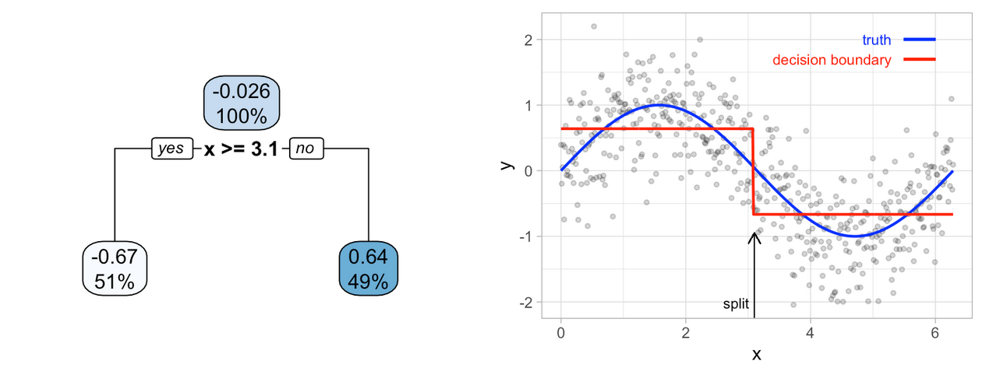
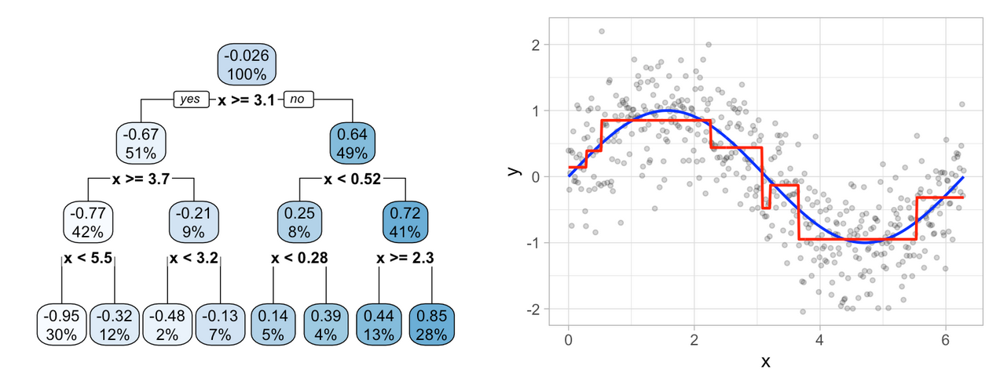
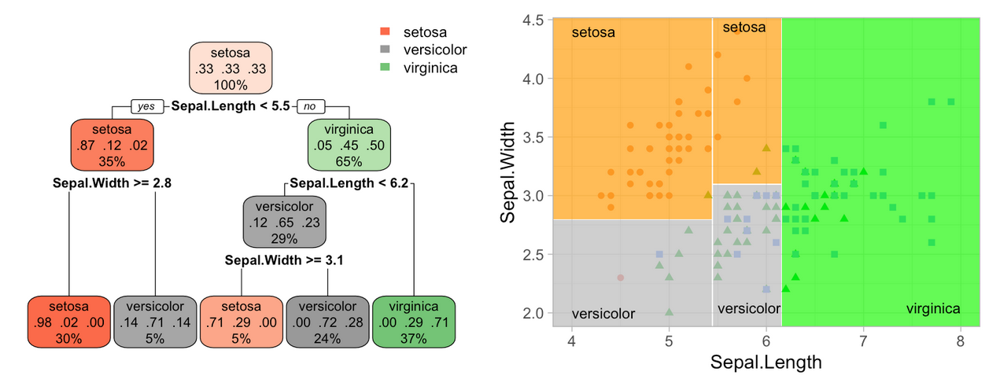
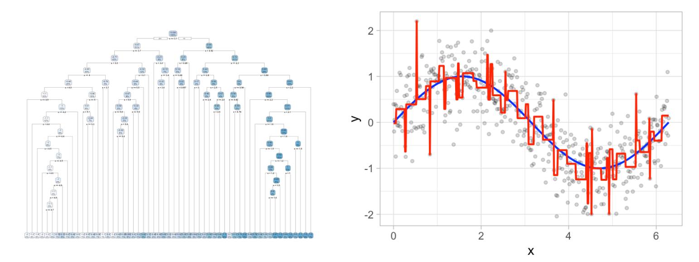
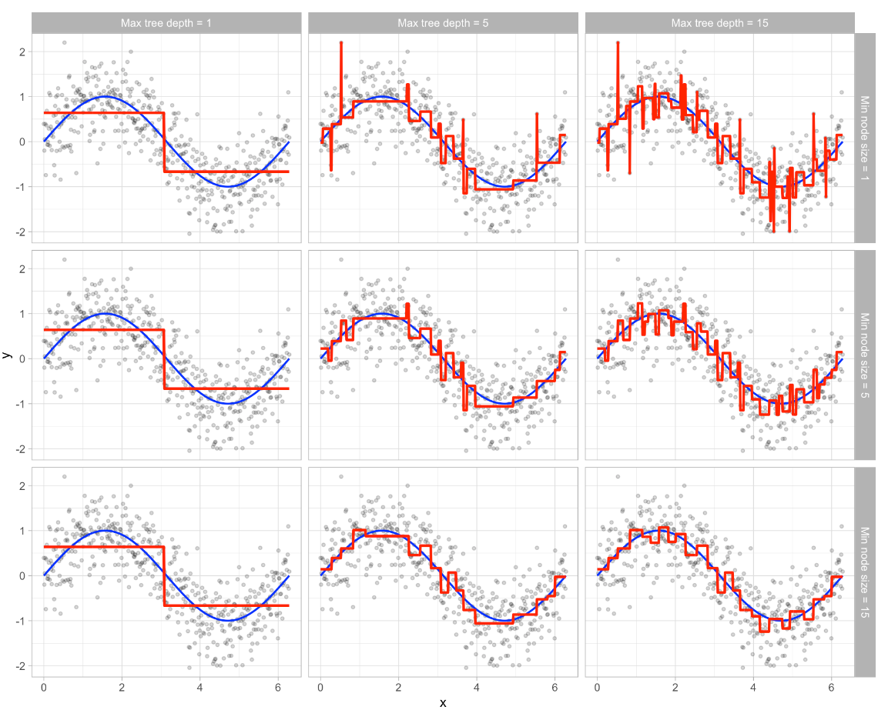
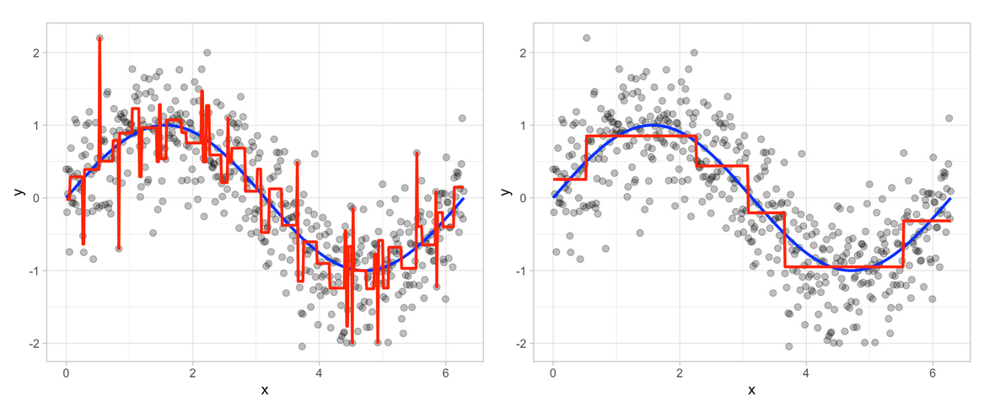
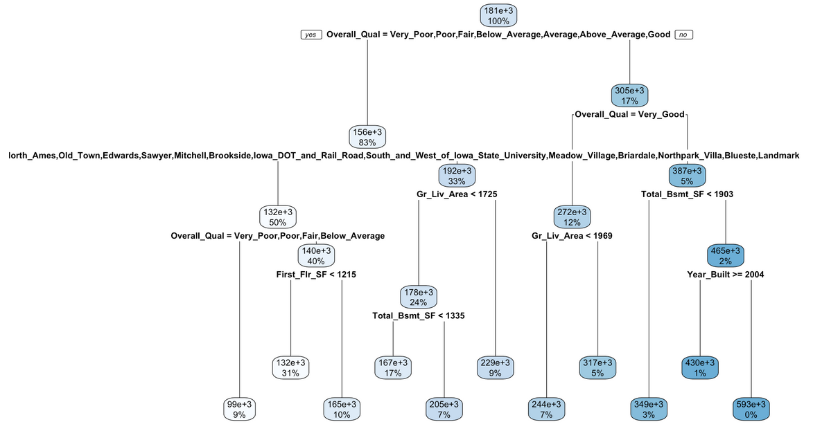

```{r xaringan-themer, include=FALSE, warning=FALSE}
library(xaringanthemer)
style_duo_accent(primary_color = "#035AA6", secondary_color = "#03A696")
```

## Packages and topics

Here are the packages that we will be using for this session.  

```{r, cache=F, message=F}
if (!require("pacman")) install.packages("pacman")
pacman::p_load(dplyr, ggplot2, rpart, caret, rpart.plot, 
               vip, pdp, doParallel, foreach, 
               ipred, ranger, gbm, xgboost, AmesHousing)
```

Many new packages -> several new topics covered.

1. Decision trees
2. Bagging
3. Random forests
4. Gradient boosting

We will probably take **two lecture slots** to get through all these topics. 

Important that you go and read on these specific topics if they interest you. 

---

## Decision trees

Partition feature space into smaller regions with similar response values. 

Use a set of **splitting rules** to decide regions. 

Referred to as divide-and-conquer methods. 

Rules can be easily interpreted and visualised with *tree diagrams*.

Decision trees become more powerful when combined with ensemble algorithms.

We will first develop strong foundation in decision trees. 

---

## CART

Classification and regression tree (**CART**) algorithm. 

Decision tree partitions the training data into homogeneous subgroups and then fits a simple constant in each subgroup.

The subgroups (also called *nodes*) are formed recursively using binary partitions formed by asking simple yes-or-no questions about each feature.

Done a number of times until a suitable stopping criteria is satisfied.


After partitioning, model predicts output based on 

1. Average response values for all observations that fall in that subgroup
2. Class that has majority representation

First is regression problem, second is classification. 

---

```{r exemplar, echo=F, fig.align = 'center', out.width = "100%", fig.cap = "Figure 1: Decision tree depicting whether consumer will redeem a coupon."}
knitr::include_graphics("https://bradleyboehmke.github.io/HOML/images/exemplar-decision-tree.png")
```


```{r terminology, echo=F, fig.align = 'center', out.width = "90%", fig.cap = "Figure 2: Terminology of a decision tree."}
knitr::include_graphics("https://bradleyboehmke.github.io/HOML/images/decision-tree-terminology.png")
```
---

## Partitioning

CART uses binary recursive partitioning -- each split depends on the split above it. 

Objective is to find the best feature to partition the remaining data into two regions ($R_1$ and $R_2$). 

Want to minimise overall error between response and predicted constant.

In regression problems, minimise total SSE as follows

$$\text{SSE} =\sum_{i \in R_{1}}\left(y_{i}-c_{1}\right)^{2}+\sum_{i \in R_{2}}\left(y_{i}-c_{2}\right)^{2}$$

Having found best feature/split combination, data are partitioned again into two regions and the splitting process is repeated. 

Process is continued until stopping criterion is reached (max depth).

---

## Creating a dataset

```{r, cache=F, message=F}
# create data
set.seed(1112)  # for reproducibility
df <- tibble::tibble(
  x = seq(from = 0, to = 2 * pi, length = 500),
  y = sin(x) + rnorm(length(x), sd = 0.5),
  truth = sin(x)
)

# run decision stump model
ctrl <- list(cp = 0, minbucket = 5, maxdepth = 1)
fit <- rpart(y ~ x, data = df, control = ctrl)
```

Here we have data generated from simple $\sin$ function with Gaussian noise. 

---

```{r stump-1, echo=F, fig.align = 'center', out.width = "150%"}

```

```{r stump-2, echo=F, fig.align = 'center', out.width = "150%"}

```


---

## Classification problem

Decision tree applied to iris data set.

Species of flower predicted based on two features (sepal width and sepal length).

Optimal decision tree with two splits in each feature.

```{r stump-3, echo=F, fig.align = 'center', out.width = "150%"}

```

Predicted value is response class with greatest proportion within enclosed region. 

---

## How complex should tree be?

```{r stump-4, echo=F, fig.align = 'center', out.width = "150%"}

```

Don't want to overfit the data, so there is some balance we need to maintain. 

Two approaches to find this balance.

1. Early stopping
2. Pruning

---

## Early stopping

Early stopping explicitly restricts the growth of the tree.

Two most common approaches are 

1. Restrict the tree depth to a certain level
2. Restrict the minimum number of observations allowed in any terminal node

Two methods can be operated independently or jointly (see figure on next slide). 

---

```{r stopping, echo=F, fig.align = 'center', out.width = "100%"}

```

---

## Pruning

Allow tree to grow large and then prune back to find optimal subtree.

Penalises objective function for number of terminal nodes in the tree. 

$$\min(\text{SSE} +\alpha |T|)$$
Shares some similarity with the **lasso penalty** we discussed in the previous lecture. 

```{r pruning, echo=F, fig.align = 'center', out.width = "100%"}

```


---

## Ames housing example

```{r, message=F}
# Create training (70%) set for the Ames housing data.
set.seed(123)

ames <- AmesHousing::make_ames()
split  <- rsample::initial_split(ames, prop = 0.7, 
                                 strata = "Sale_Price")
ames_train  <- rsample::training(split)

ames_dt1 <- rpart(
  formula = Sale_Price ~ .,
  data    = ames_train,
  method  = "anova"
)

```
For the decision tree we want to use the `anova` method, instead of `lm`. 

`rpart` will make an educated guess as to the method, but we can specify if we want. 

---

```{r, message=F}
ames_dt1
```
---

## Pruned decision tree (Ames)

```{r pruned-ames, echo=F, fig.align = 'center', out.width = "120%"}

```

---

```{r, message=F, echo = F}
ames_dt2 <- train(
  Sale_Price ~ .,
  data = ames_train,
  method = "rpart",
  trControl = trainControl(method = "cv", number = 10),
  tuneLength = 20
)
```

```{r, message = F}
ames_dt2
```

---
```{r, regression_1, cache=F, message=F, echo=F, fig.retina = 2, fig.width = 10, fig.height = 8, fig.align = 'center'}
ggplot(ames_dt2)
```
---

## Bagging

*Bootstrap aggregating* (bagging) will be our first ensemble algorithm. 

Model averaging is applied to reduce variance and minimise overfitting. 

Usually applied to **decision trees**!

With bagging $b$ bootstrap copies of the original training data are created.

Regression or classification algorithm is applied to each bootstrap sample.

 - For regression, new predictions are made by averaging predictions 
 - For classification, predictions combined by averaging estimated class. 
 
Equation below shows bagged prediction and prediction from regression or classification algorithms. 

$$\widehat{f_{b a g}}=\widehat{f_{1}}(X)+\widehat{f_{2}}(X)+\cdots+\widehat{f_{b}}(X)$$

Bagging works well for high variance algorithms such as decision trees and KNN. 

---

```{r, bagging-1, cache=F, message=F, echo=F, fig.retina = 2, fig.width = 10, fig.height = 8, fig.align = 'center'}
# Simulate some nonlinear monotonic data
set.seed(123)  # for reproducibility
x <- seq(from = 0, to = 2 * pi, length = 500)
y <- sin(x) + rnorm(length(x), sd = 0.3)
df <- data.frame(x, y) %>%
  filter(x < 4.5)

# bootstrapped polynomial model fit
bootstrap_n <- 100
bootstrap_results <- NULL
for(i in seq_len(bootstrap_n)) {
  # reproducible sampled data frames
  set.seed(i)
  index <- sample(seq_len(nrow(df)), nrow(df), replace = TRUE)
  df_sim <- df[index, ]
  
  # fit model and add predictions to results data frame
  fit <- lm(y ~ I(x^3), data = df_sim)
  df_sim$predictions <- predict(fit, df_sim)
  df_sim$model <- paste0("model", i)
  df_sim$ob <- index
  bootstrap_results <- rbind(bootstrap_results, df_sim)
}

p1 <- ggplot(bootstrap_results, aes(x, predictions)) +
  geom_point(data = df, aes(x, y), alpha = .25) +
  geom_line(aes(group = model), show.legend = FALSE, size = .5, alpha = .2) +
  stat_summary(fun = "mean", colour = "red", size = 1, geom = "line") +
  scale_y_continuous("Response", limits = c(-2, 2), expand = c(0, 0)) +
  scale_x_continuous(limits = c(0, 5), expand = c(0, 0)) +
  ggtitle("A) Polynomial regression")

# bootstrapped MARS model fit
bootstrap_n <- 100
bootstrap_results <- NULL
for(i in seq_len(bootstrap_n)) {
  # reproducible sampled data frames
  set.seed(i)
  index <- sample(seq_len(nrow(df)), nrow(df), replace = TRUE)
  df_sim <- df[index, ]
  
  # fit model and add predictions to results data frame
  fit <- earth::earth(y ~ x, data = df_sim)
  df_sim$predictions <- predict(fit, df_sim)
  df_sim$model <- paste0("model", i)
  df_sim$ob <- index
  bootstrap_results <- rbind(bootstrap_results, df_sim)
}

p2 <- ggplot(bootstrap_results, aes(x, predictions)) +
  geom_point(data = df, aes(x, y), alpha = .25) +
  geom_line(aes(group = model), show.legend = FALSE, size = .5, alpha = .2) +
  stat_summary(fun = "mean", colour = "red", size = 1, geom = "line") +
  scale_y_continuous(NULL, limits = c(-2, 2), expand = c(0, 0)) +
  scale_x_continuous(limits = c(0, 5), expand = c(0, 0)) +
  ggtitle("B) MARS")

# bootstrapped decision trees fit
bootstrap_n <- 100
bootstrap_results <- NULL
for(i in seq_len(bootstrap_n)) {
  # reproducible sampled data frames
  set.seed(i)
  index <- sample(seq_len(nrow(df)), nrow(df), replace = TRUE)
  df_sim <- df[index, ]
  
  # fit model and add predictions to results data frame
  fit <- rpart::rpart(y ~ x, data = df_sim)
  df_sim$predictions <- predict(fit, df_sim)
  df_sim$model <- paste0("model", i)
  df_sim$ob <- index
  bootstrap_results <- rbind(bootstrap_results, df_sim)
}

p3 <- ggplot(bootstrap_results, aes(x, predictions)) +
  geom_point(data = df, aes(x, y), alpha = .25) +
  geom_line(aes(group = model), show.legend = FALSE, size = .5, alpha = .2) +
  stat_summary(fun = "mean", colour = "red", size = 1, geom = "line") +
  scale_y_continuous(NULL, limits = c(-2, 2), expand = c(0, 0)) +
  scale_x_continuous(limits = c(0, 5), expand = c(0, 0)) +
  ggtitle("C) Decision trees")

gridExtra::grid.arrange(p1, p2, p3, nrow = 1)
```

---

## Housing example

Results from decision trees on our Ames example were not too encouraging. 

Even after tuning to find best pruned tree, performance not great.  

Move from using single pruned decision tree to 100 bagged unpruned trees. 

Not pruning keeps variance high and bias low. 

```{r, message = F}
# make bootstrapping reproducible
set.seed(123)

# train bagged model
ames_bag1 <- bagging(
  formula = Sale_Price ~ .,
  data = ames_train,
  nbagg = 100,  
  coob = TRUE,
  control = rpart.control(minsplit = 2, cp = 0)
)
```

---

## Housing example -- contd. 

```{r, message = F}
ames_bag1
```

---

```{r, bagging-2, cache=F, message=F, echo=F, fig.retina = 2, fig.width = 10, fig.height = 8, fig.align = 'center'}
# using ranger to do the same as above.  Will allow for bagging under 10 trees
# and is much faster!
ntree <- seq(1, 200, by = 2)
# create empty vector to store OOB RMSE values
rmse <- vector(mode = "numeric", length = length(ntree))

for (i in seq_along(ntree)) {
  # reproducibility
  set.seed(123)
  # perform bagged model
  model <- ranger::ranger(
  formula = Sale_Price ~ .,
  data    = ames_train,
  num.trees = ntree[i],
  mtry = ncol(ames_train) - 1,
  min.node.size = 1
)
  # get OOB error
  rmse[i] <- sqrt(model$prediction.error)
}

bagging_errors <- data.frame(ntree, rmse)

ggplot(bagging_errors, aes(ntree, rmse)) +
  geom_line() +
  geom_hline(yintercept = 41019, lty = "dashed", color = "grey50") +
  annotate("text", x = 100, y = 41385, label = "Best individual pruned tree", vjust = 0, hjust = 0, color = "grey50") +
  annotate("text", x = 100, y = 26750, label = "Bagged trees", vjust = 0, hjust = 0) +
  ylab("RMSE") +
  xlab("Number of trees")
```
---

## Next time

Next class will be our last lecture focused exclusively on machine learning. 

We might mention a model or two as we progress, but most of our focus will be on **data science** topics. 

In the next lecture we cover two topics. 

1. Random forests
2. Gradient boosting

It would be great to cover support vector machines and neural networks at some stage. Let us see how far we get with the other sections though. 


